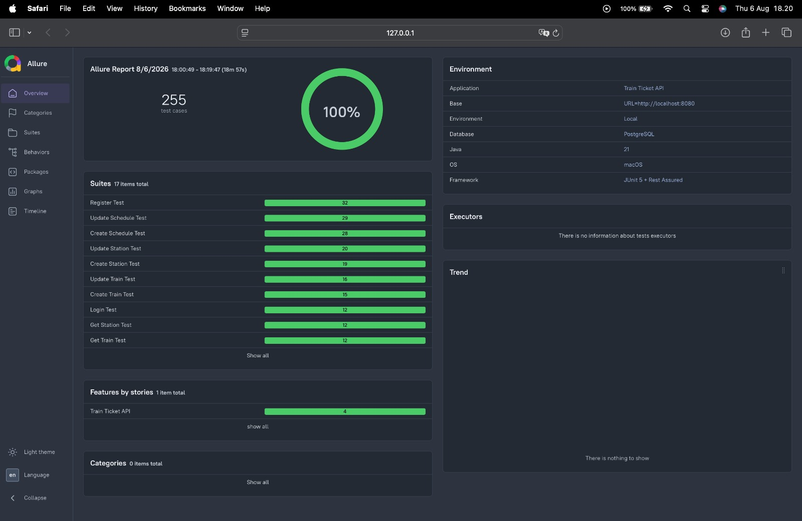
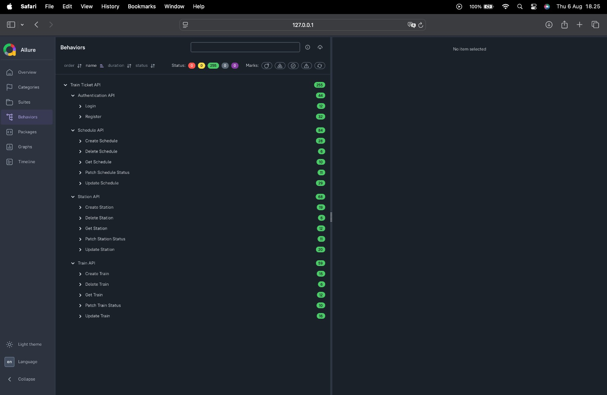
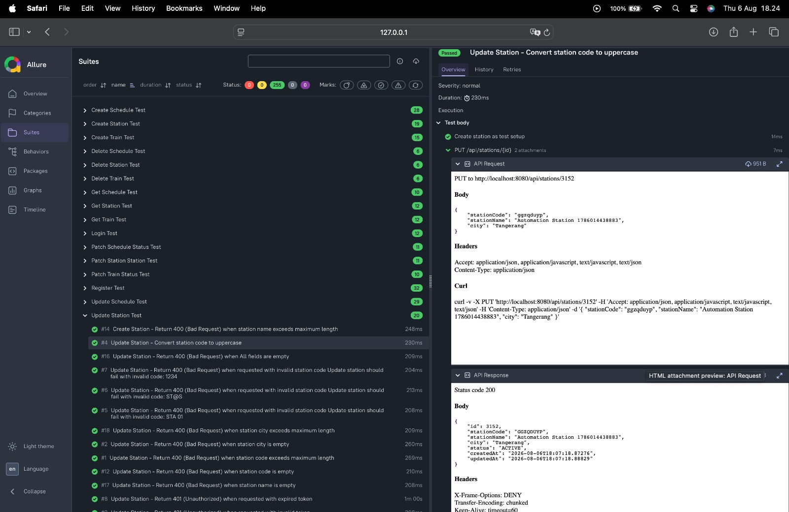

# 🚆 Train Ticket API Automation

Comprehensive API Automation Testing project for a **Train Ticket Booking System** built using **Java**, **REST Assured**, **JUnit 5**, **Allure Report**, and **PostgreSQL**.

This project demonstrates enterprise-level API testing practices, including authentication, positive and negative scenarios, response validation, database verification, reusable test utilities, dynamic test data generation, and comprehensive reporting.

---

## 📌 Project Overview

This automation framework validates REST APIs of the Train Ticket backend application by verifying:

- API response correctness
- Business rule validation
- Authentication & authorization
- Database consistency
- Error handling
- Response performance

The project follows clean automation architecture with reusable utilities and maintainable test design.

---

## 🔗 Related Backend Project

This automation framework is built specifically to validate the backend REST API developed in a separate repository.

The backend application includes:

- JWT Authentication
- Role-Based Authorization
- CRUD APIs
- Schedule Management
- Booking Management
- PostgreSQL Database
- Spring Boot REST API
- Bean Validation
- Global Exception Handling

**Backend Repository**

👉 https://github.com/hermansiswanto/train_ticket_api

---

# 🛠 Tech Stack

| Category | Technology |
|----------|------------|
| Language | Java 21 |
| Build Tool | Maven |
| Test Framework | JUnit 5 |
| API Testing | REST Assured |
| Reporting | Allure Report |
| Database | PostgreSQL |
| JSON | Jackson |
| Assertions | JUnit Assertions + Hamcrest |

---

# 📂 Project Structure

```
src
├── main
│   └── java                 # Shared utilities
└── test
    ├── java
    │   ├── auth             # Authentication helpers
    │   ├── base             # Base test configuration
    │   ├── model            # Database models
    │   ├── schedule         # Schedule API tests
    │   ├── station          # Station API tests
    │   ├── train            # Train API tests
    │   └── utils            # Test utilities
    └── resources            # Configuration files
```

---

# 🏗 Test Architecture

The framework follows a layered design to keep test cases clean and maintainable.

- **BaseTest** – shared configuration and REST Assured setup
- **Authentication Utilities** – reusable JWT authentication helpers
- **Test Data Generator** – generates unique test data for isolated execution
- **Request Helpers** – reusable API request methods
- **Assertion Helpers** – reusable response validation
- **Database Utilities** – verifies data persistence directly in PostgreSQL

---

# ✅ Test Coverage

The automation suite covers major REST API functionalities including:

## Authentication

- User Login
- Admin Login
- Invalid Credentials
- Expired Token
- Unauthorized Access

## Train API

- Create Train
- Update Train
- Delete Train
- Get Train
- Search Train

## Station API

- Create Station
- Update Station
- Delete Station
- Get Station
- Search Station

## Schedule API

- Create Schedule
- Update Schedule
- Patch Schedule Status
- Get Schedule
- Search Schedule

Each API includes:

- Positive scenarios
- Negative scenarios
- Validation testing
- Authentication testing
- Authorization testing
- Database verification

---

# ✨ Key Features

- REST Assured API Automation
- Reusable Base Test
- Dynamic Test Data Generator
- PostgreSQL Database Verification
- Authentication Utilities
- Allure Reporting
- Parameterized Tests
- Clean Test Architecture
- Response Time Validation
- Reusable Helper Methods

---

# 🗄 Database Verification

This project also verifies data persistence directly against PostgreSQL.

Example verification includes:

- Created records
- Updated records
- Deleted records
- Business status changes
- Data consistency

This ensures the backend successfully persists data after every operation.

---

# 📊 Allure Report

## Dashboard



---

## Behaviors



---

## Test Suit Example



---

# ▶️ Running the Tests

Run all tests

```bash
mvn clean test
```

Generate Allure Report

```bash
allure serve allure-results
```

---

Run specific test class

```bash
mvn clean test -Dtest=CreateScheduleTest
```

Run specific package

```bash
mvn clean test -Dtest="com.herman.automation.schedule.*Test"
```

---

Run test & generate allure report

```bash
mvn clean test && allure serve allure-results
```

# 📈 Test Design

The project follows a reusable automation design:

- Base Test Class
- Authentication Utilities
- Database Utilities
- Test Data Generator
- Reusable Request Methods
- Reusable Assertion Methods

Business actions and verification steps are documented using **Allure @Step**, producing readable execution reports.

Example:

```
Authenticate as admin user

Create Schedule for test setup

Update schedule status

Verify successful schedule update response

Verify schedule status in database
```

---

# 🚀 Future Improvements

## CI/CD
- [ ] Configure GitHub Actions to automatically build the backend, execute API automation tests, and publish test artifacts on every push.

## Test Automation
- [ ] Refactor common API helpers into reusable utility classes.
- [ ] Add support for test execution by tags (Smoke, Regression, Sanity).
- [ ] Improve Allure reports with custom attachments and environment details.

## Postman
- [ ] Convert static request payloads to dynamic variables and pre-request scripts.
- [ ] Support full collection execution without manual data updates.

## Backend
- [ ] Add Docker Compose for one-command local setup.
- [ ] Expand API coverage with Ticket Booking, Payment, and Seat Reservation modules.

---

# 👨‍💻 Author

**Herman Siswanto**

QA Engineer | API Testing | Automation Testing | Java | REST Assured | PostgreSQL | Allure Report